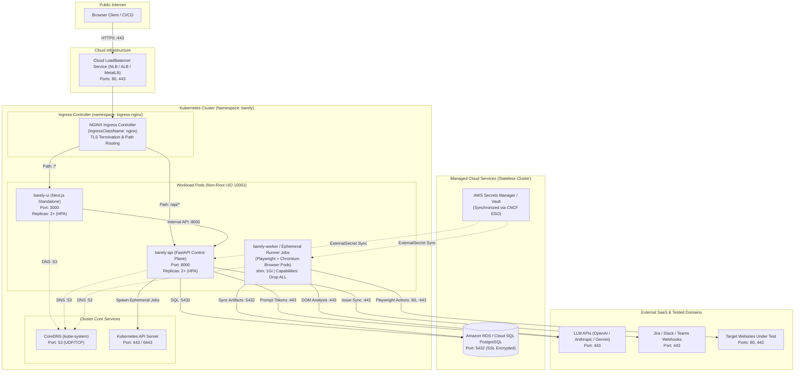

<div align="center">

<br/>


<br/>

**Declarative AI-driven end-to-end testing for modern web applications.**

[](https://github.com/GitanshKapoor/barely/releases)
[](https://python.org)
[](https://nextjs.org)
[](https://www.typescriptlang.org)
[](https://tailwindcss.com)
[](https://fastapi.tiangolo.com)
[](https://playwright.dev)
[](https://www.postgresql.org)
[](https://www.docker.com)
[](LICENSE)
[](https://github.com/GitanshKapoor/barely/pulls)

</div>

---

Barely is an open-source autonomous AI agent designed to replace manual QA testing. Write your test goals in plain English, and Barely's AI agent will autonomously execute them via Playwright, maintain visual baselines, generate professional deliverables, and auto-heal dynamic selectors. 


## 🌟 What is Barely?

Traditional end-to-end testing requires teams to write hundreds of lines of brittle automation code that breaks every time a button changes color or a div moves. Barely takes a different approach: **Declarative Goal-Based Autonomous QA**.

You define the *test intent* and *assertions* in natural language — Barely's autonomous agent figures out the exact steps, elements, and browser actions to achieve and verify it.

### 🌟 Release 1.0 "Baby Kangaroo" Core Capabilities:
- 🧠 **Autonomous AI Execution:** Leverages multi-modal LLMs (Anthropic Claude 3.5 Sonnet, OpenAI, Gemini, Groq) via LiteLLM to analyze the live DOM and execute steps via Playwright.
- ⚡ **Action Plan Caching:** Once the AI figures out a test, it caches the exact actions directly in PostgreSQL. Subsequent runs cost $0 and execute in milliseconds.
- 🏷️ **Test Suite Tags & Classification:** Categorize test runs (`#smoke`, `#regression`, `#auth`, `#p0`, `#e2e`) with quick-toggle presets and multi-suite filtering.
- 🎯 **Strict Mode & Autonomous Auto-Healing:** Strict locator uniqueness enforcement or resilient autonomous auto-healing for dynamic selectors.
- 🖼️ **Autonomous Visual Baselines:** Capture and preview golden UI viewport snapshots across Desktop, Tablet, iOS, and Android device profiles.
- 📊 **Executive PDF Reports & Artifact Bundles:** One-click export of print-ready multi-page PDF audit reports and downloadable `.zip` bundles (`REPORT.md`, `report.html`, `run_data.json`) with structured 4-tier step auditing (Target Goal Step, AI Agent Reasoning, Human-Readable Action Executed, and Viewport Snapshot).
- 🧩 **Human-Readable Element Abstraction:** Automatically translates low-level DOM IDs into clean, business-level UI labels (e.g. `Clicked "Google Search" button`, `Typed 'Gitansh Kapoor' into "Search" input field`) for non-technical stakeholders.
- 🔄 **Live CI/CD Audit Timeline:** Real-time console log streaming, step-by-step DOM timelines, and one-click re-run & reconfigure modal.
- 🗄️ **Zero-Disk Runtime Architecture:** 100% of runs, logs, screenshots, and cached action plans persist directly in PostgreSQL.

## 🗺️ Coming in Release 2.0 (Roadmap)
- 🐛 **Automated Defect Management (Jira / GitHub Issues):** Auto-create rich bug tickets with reproduction steps, error logs, and failure screenshots.
- 🔐 **Enterprise Secrets Management:** Native integration with AWS Secrets Manager, HashiCorp Vault, and encrypted secret stores so credentials are never hardcoded.
- ☁️ **Cloud-Native Kubernetes (K8s) & AWS ECS Integration:** Production-ready Helm charts, Kubernetes Operator / pod autoscalers, and AWS ECS task definitions for horizontally orchestrating agent runners at enterprise cloud scale.
- 🤝 **Distributed Multi-Agent Fleet:** Coordinated fleet of parallel autonomous agents executing across sharded test suites.
- 🔔 **Real-Time Webhook & Slack Alerts:** Instant notifications on test completions, visual regressions, and pipeline failures.

## 🚀 Getting Started

Barely is built for speed and simplicity. It can be launched instantly with Docker Compose or installed locally as a Python package.

### Option A: Quickstart with Docker Compose (Recommended)

Clone the repository and launch the full platform (PostgreSQL, Control Plane API, Background Worker, and Next.js UI) in seconds:

```bash
git clone https://github.com/GitanshKapoor/barely.git
cd barely
cp .env.example .env    # Configure your LLM API keys
docker compose up -d
```

Once running, access:
- 🌐 **Web Dashboard:** [http://localhost:3000](http://localhost:3000)
- 🔌 **API Documentation:** [http://localhost:8000/docs](http://localhost:8000/docs)

---

### Option B: Local CLI Installation

Install Barely as a standalone Python CLI:

```bash
# We recommend using uv for lightning-fast installation
uv pip install barely
```

**1. Initialize a Workspace**
```bash
barely init
```

**2. Write a Test Goal with Application Context** (`.barely/goals/checkout.md`)
```markdown
---
name: Checkout Flow
tags: [smoke, e2e]
timeout: 120
context: "You are testing an e-commerce store ABC. Act as a shopper browsing the catalog, managing cart, and purchasing."
---
# Test Checkout Flow
1. Navigate to the homepage
2. Search for "Laptop"
3. Add the first result to the cart
4. Verify the cart badge displays "1"
```

**3. Run the Agent (with optional CLI context override)**
```bash
barely run \
  --url https://staging.myapp.com \
  --goal .barely/goals/checkout.md \
  --context "You are testing an e-commerce store ABC" \
  --model anthropic/claude-sonnet-4-5
```

## 🏗️ Enterprise Deployment Architectures

Barely provides production-grade deployment manifests across three environments: **Hardened Docker Compose**, **Kubernetes (Helm Chart)**, and **AWS ECS Fargate (Terraform)**.

### 🧭 Deployment Guide Navigation

| Target Environment | Description | Dedicated Installation Runbook |
| :--- | :--- | :--- |
| 🐳 **Docker Compose** | Multi-bridge network isolation, non-root execution, 1GB `/dev/shm` for Chromium, zero DB host ports. | [📖 deploy/docker/README.md](deploy/docker/README.md) |
| ⎈ **Kubernetes (Helm)** | NGINX Ingress Controller, LoadBalancer Service, zero-trust `NetworkPolicy`, HPA, Cloud DB, External Secrets (ESO). | [📖 charts/barely/README.md](charts/barely/README.md) |
| ☁️ **AWS ECS (Terraform)** | 100% Private VPC subnets (`assign_public_ip = false`), ALB path routing, AWS Cloud Map DNS, Secrets Manager. | [📖 deploy/terraform/README.md](deploy/terraform/README.md) |
| 🚀 **CI/CD Integration** | Autonomous AI tests on Pull Requests, GitHub Secrets setup, PR merge gating, PDF report artifacts. | [📖 deploy/ci-cd/README.md](deploy/ci-cd/README.md) |

---

### 1. Kubernetes Architecture (Helm Deployment)



---

### 2. AWS ECS Fargate Architecture (Terraform)

```mermaid
flowchart TD
    subgraph Internet["Public Internet"]
        User["User / CI Pipeline"]
    end

    subgraph AWSVPC["AWS VPC (10.0.0.0/16)"]
        subgraph PublicSubnets["Public Subnets (AZ-a, AZ-b)"]
            ALB["Application Load Balancer (ALB)\nSecurity Group: sg-alb\nPorts: 80 (Redirect), 443 (HTTPS)"]
            NAT["NAT Gateways (AZ-a, AZ-b)\nOutbound Internet Access"]
        end

        subgraph PrivateAppSubnets["Private Application Subnets (AZ-a, AZ-b)"]
            subgraph CloudMap["AWS Cloud Map (Private DNS: barely.internal)"]
                API_DNS["api.barely.internal:8000"]
                UI_DNS["ui.barely.internal:3000"]
            end

            ECSUi["ECS Service: barely-ui\n(AWS Fargate)\nSecurity Group: sg-ecs-ui\nPort: 3000 | Non-Root UID 10001\nassign_public_ip: false"]
            ECSApi["ECS Service: barely-api\n(AWS Fargate)\nSecurity Group: sg-ecs-api\nPort: 8000 | Non-Root UID 10001\nassign_public_ip: false"]
            ECSWorker["ECS Service: barely-worker\n(AWS Fargate / Fargate Spot)\nSecurity Group: sg-ecs-worker\n0 Inbound Ports | Non-Root UID 10001\nassign_public_ip: false"]
        end

        subgraph PrivateDataSubnets["Private Database Subnets (AZ-a, AZ-b)"]
            RDS[("Amazon RDS PostgreSQL 16\nSecurity Group: sg-rds\nPort: 5432 (SSL Required)")]
        end

        subgraph AWSServices["Managed AWS Services"]
            SM["AWS Secrets Manager & KMS\n(API Keys & DB Credentials)"]
            CW["CloudWatch Log Group\n(/ecs/barely-prod)"]
        end
    end

    User -->|HTTPS :443| ALB
    ALB -->|Route /* :3000| ECSUi
    ALB -->|Route /api/* :8000| ECSApi
    ECSUi -->|Internal :8000 (api.barely.internal)| ECSApi
    ECSApi -->|SQL :5432| RDS
    ECSWorker -->|SQL :5432| RDS
    ECSApi -.->|Task Execution Role| SM
    ECSWorker -.->|Task Execution Role| SM
    ECSApi -.-> CW
    ECSWorker -.-> CW
    ECSUi -.-> CW
    ECSApi -->|NAT Gateway :443| NAT
    ECSWorker -->|NAT Gateway :80, :443| NAT
    NAT -->|HTTPS :443| ExternalAPIs["OpenAI / Anthropic / Tested Domains"]
```

---

## 🛡️ Enterprise Security Hardening Specification

### 1. Zero-Trust Kubernetes Network Policies (`netpol`)
- **Default-Deny**: All untracked ingress and egress traffic is dropped at the Linux kernel level (via iptables/eBPF).
- **UI Pods**: Ingress allowed strictly from NGINX Ingress on port 3000; egress allowed strictly to API on port 8000 and CoreDNS on port 53. **UI is 100% physically blocked from database access.**
- **API Pods**: Ingress from Ingress and UI on port 8000; egress to PostgreSQL (5432), Kubernetes API (443/6443), CoreDNS (53), and external HTTPS (443).
- **Runner Pods**: **Zero inbound ports** (default-deny ingress). Lateral pod-to-pod communication is strictly denied.
- **Database**: Port 5432 accessible strictly by API and Runner workloads.

### 2. Tiered AWS Security Groups Matrix
- **`sg-alb`**: Ingress `0.0.0.0/0` on 80/443; egress strictly to `sg-ecs-ui` (port 3000) and `sg-ecs-api` (port 8000).
- **`sg-ecs-ui`**: Ingress allowed strictly from `sg-alb` on port 3000; egress to `sg-ecs-api` on port 8000.
- **`sg-ecs-api`**: Ingress allowed strictly from `sg-alb` and `sg-ecs-ui` on port 8000; egress to `sg-rds` on 5432 and outbound 443 via NAT.
- **`sg-ecs-worker`**: **0 Inbound rules**. Egress to `sg-rds` on 5432 and outbound 80/443 via NAT.
- **`sg-rds`**: Ingress strictly from `sg-ecs-api` and `sg-ecs-worker` on 5432; 0 outbound rules.

### 3. Container & Pod Security Standards (Restricted PSS)
- **Non-Root Execution**: Every container runs as an unprivileged user (UID `10001:10001`).
- **Capabilities Dropped**: `capabilities: { drop: ["ALL"] }` removes all privileged Linux capabilities.
- **No Privilege Escalation**: `allowPrivilegeEscalation: false` prevents `setuid` binaries from gaining elevated privileges.
- **Chromium Stability**: Dedicated 1GB `/dev/shm` shared memory allocation (`shm_size: 1gb` in Docker, `emptyDir: medium: Memory` in Kubernetes, `sharedMemorySize: 1024` in ECS).

---

## 📚 Dedicated Documentation & Runbooks

For detailed setup, configuration parameters, and step-by-step installation runbooks, refer to:
- 🐳 **[Docker Compose Deployment Guide](deploy/docker/README.md)**
- ⎈ **[Kubernetes Helm Chart Guide](charts/barely/README.md)**
- ☁️ **[AWS ECS Fargate Terraform Guide](deploy/terraform/README.md)**
- 🚀 **[CI/CD Pipeline Integration Guide](deploy/ci-cd/README.md)**


## 💬 Community

- **Discord:** Join our community server (Coming soon)
- **Twitter:** Follow us for updates (Coming soon)

## 🤝 Contributing

We welcome contributions! Whether you're fixing bugs, adding new features, or improving documentation, please feel free to open a Pull Request. 

See our [Contributing Guide](CONTRIBUTING.md) (coming soon) for more details.

## 👨‍💻 Author & Creator

Created and maintained by **Gitansh Kapoor**:
- 💼 **LinkedIn:** [linkedin.com/in/gitansh16k](https://www.linkedin.com/in/gitansh16k)
- 🐙 **GitHub:** [@GitanshKapoor](https://github.com/GitanshKapoor)

## 📄 License

This project is licensed under the MIT License - see the [LICENSE](LICENSE) file for details.
