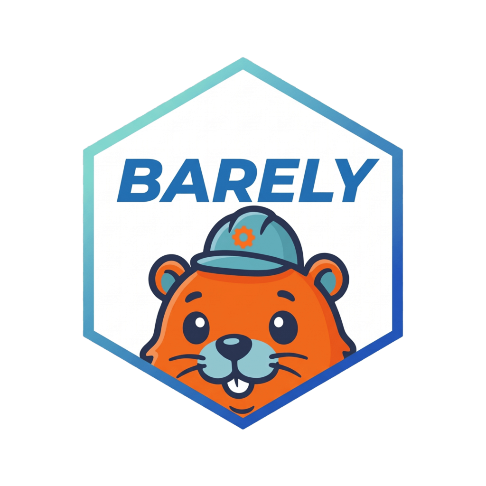
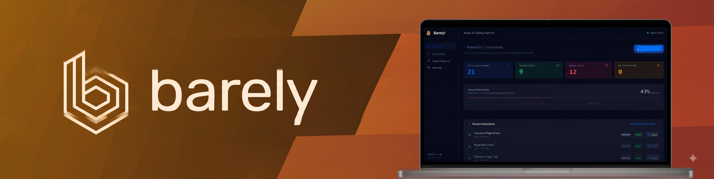

<div align="center">

<br/>



<br/>

**Declarative AI-driven end-to-end testing for modern web applications.**

[](https://github.com/GitanshKapoor/barely/releases)
[](https://python.org)
[](https://nextjs.org)
[](https://www.typescriptlang.org)
[](https://fastapi.tiangolo.com)
[](https://playwright.dev)
[](charts/barely)
[](deploy/terraform)
[](https://www.docker.com)
[](https://www.postgresql.org)
[](LICENSE)
[](https://gitanshkapoor.github.io/barely/)
[](https://github.com/GitanshKapoor/barely/pulls)

</div>

---

Barely is an open-source autonomous AI agent designed to replace manual QA testing. Write your test goals in plain English, and Barely's AI agent will autonomously execute them via Playwright, maintain visual baselines, generate professional deliverables, and auto-heal dynamic selectors. 



## 🌟 What is Barely?

Traditional end-to-end testing requires teams to write hundreds of lines of brittle automation code that breaks every time a button changes color or a div moves. Barely takes a different approach: **Declarative Goal-Based Autonomous QA**.

You define the *test intent* and *assertions* in natural language — Barely's autonomous agent figures out the exact steps, elements, and browser actions to achieve and verify it.

## ⚡ Core Capabilities

Barely combines vision-enabled AI reasoning with enterprise cloud execution primitives:

- 🧠 **Autonomous AI Execution:** Leverages multi-modal LLMs (Anthropic Claude, OpenAI GPT, Google Gemini, Groq) via LiteLLM to analyze the live DOM and execute steps via Playwright.
- ⚡ **Action Plan Caching:** Once the AI determines the optimal test path, it caches the exact actions directly in PostgreSQL. Subsequent regression runs cost $0 and execute in milliseconds.
- 🎯 **Strict Mode & Autonomous Auto-Healing:** Enforce strict selector uniqueness or autonomously heal dynamic, shifting locators on UI updates.
- 🖼️ **Autonomous Visual Baselines:** Capture and compare golden UI viewport snapshots across Desktop, Tablet, iOS, and Android device profiles.
- 🎫 **Automated Issue Tracking (Jira & GitHub):** Automated defect filing to Atlassian Jira and GitHub Issues on test failures with reproduction steps, error logs, and direct issue tracking links.
- 🔔 **Enterprise Incident Notifications:** Real-time Slack and Microsoft Teams webhook alerts with structured failure cards, run status, and deep links.
- 🔐 **Zero-Leak Enterprise Secrets Management:** Dynamic AES-256 Fernet encryption in PostgreSQL, zero-leak masking in UI/API, and seamless External Secrets (ESO) Kubernetes support.
- ☁️ **Cloud-Native Kubernetes & AWS ECS:** Ephemeral non-root container runner jobs (`UID 10001`), production Helm charts with HPA, and AWS ECS Fargate Terraform task definitions.
- 📊 **Executive PDF Reports & Artifact Bundles:** One-click export of print-ready multi-page audit PDFs and downloadable `.zip` bundles with step screenshots and video traces.

> 🌐 **Interactive Documentation & Roadmap:** Explore visual architectural topologies, cloud execution runbooks, and upcoming Release 3.0 milestones in our [Interactive Documentation Portal](https://gitanshkapoor.github.io/barely/#roadmap).

## 🚀 Getting Started

### Option A: Native CLI (Recommended)

Up and running in 60 seconds. Zero-assumption installers handle everything — packages, Python venv, Playwright Chromium, and `.env` generation:

```bash
# One-line install (auto-detects Ubuntu, RHEL, macOS, Windows)
curl -sSL https://raw.githubusercontent.com/GitanshKapoor/barely/main/install.sh | bash
source .venv/bin/activate

# Configure your AI provider key (hidden prompt — nothing saved to shell history)
barely secret set ANTHROPIC_API_KEY

# Verify environment
barely doctor

# Choose your AI model
barely model set anthropic/claude-sonnet-4-5

# Initialize workspace and run your first test
barely init
barely run .barely/goals/example.md --url https://example.com
```

After every `barely run`, the CLI automatically generates PDF reports and — if configured — files Jira bugs, creates GitHub issues, and sends Slack/Teams notifications on failure.

> On headless Linux cloud instances or SSH sessions without `$DISPLAY`, Barely automatically activates `--headless` mode.

---

### Option B: Docker Compose (Recommended for Teams)

Launch the full platform (PostgreSQL, Control Plane API, Background Worker, and Next.js UI) in seconds:

```bash
git clone https://github.com/GitanshKapoor/barely.git
cd barely
cp .env.example .env    # Configure your LLM API keys
docker compose up -d
```

Once running, access:
- 🌐 **Web Dashboard:** [http://localhost:3000](http://localhost:3000)
- 🔌 **API Documentation:** [http://localhost:8000/docs](http://localhost:8000/docs)

## 🏗️ Enterprise Cloud Deployments & Runbooks

Barely is engineered for cloud scale with production-ready installation runbooks and infrastructure manifests:

| Target Environment | Key Highlights | Dedicated Installation Runbook |
| :--- | :--- | :--- |
| 🐳 **Docker Compose** | Full stack in one command — PostgreSQL, API, Worker, and Dashboard. Clone, configure `.env`, run `docker compose up`. | [📖 Docker Compose Guide](deploy/docker/README.md) |
| ⎈ **Kubernetes (Helm v3)** | Production Helm chart, NGINX Ingress, HPA horizontal autoscaling, zero-trust `NetworkPolicy`, External Secrets (ESO). | [📖 Kubernetes Helm Guide](charts/barely/README.md) |
| ☁️ **AWS ECS Fargate** | Self-contained module — creates VPC, subnets, NAT, RDS, ALB, Secrets Manager automatically. Fill 2 values, run `terraform apply`. | [📖 AWS ECS Deployment Guide](deploy/terraform/README.md) |
| 🚀 **CI/CD Integration** | Autonomous AI tests on Pull Requests, GitHub Secrets setup, PR merge gating, PDF report artifacts. | [📖 CI/CD Integration Guide](deploy/ci-cd/README.md) |

### Enterprise Security Standards
- **Non-Root Execution**: Every workload runs strictly as an unprivileged user (UID `10001:10001`).
- **Restricted Capabilities**: Linux kernel capabilities are explicitly stripped (`capabilities: drop: ["ALL"]`).
- **No Privilege Escalation**: Prevents privilege escalation attacks across container lifecycles.
- **Dedicated Chromium Memory**: 1GB dedicated `/dev/shm` on Docker Compose and Kubernetes avoids browser memory fragmentation. AWS Fargate caps `/dev/shm` at 64MB and rejects `sharedMemorySize`, so Chromium there automatically falls back to disk-backed `/tmp`.
- **Architecture Topologies**: For full architectural diagrams and firewall rules, explore the dedicated runbooks linked above.

## 💬 Community

- **Discord:** Join our community server (Coming soon)
- **Twitter:** Follow us for updates (Coming soon)

## 🤝 Contributing

We welcome contributions! Whether you're fixing bugs, adding new LLM providers, or improving documentation, please feel free to open a Pull Request. 

Please review our [Contributing Guide](CONTRIBUTING.md) for local setup, coding standards, testing instructions, and commit guidelines.

## 👨‍💻 Author & Creator

Created and maintained by **Gitansh Kapoor**:
- 💼 **LinkedIn:** [linkedin.com/in/gitansh16k](https://www.linkedin.com/in/gitansh16k)
- 🐙 **GitHub:** [@GitanshKapoor](https://github.com/GitanshKapoor)

## 📄 License

This project is licensed under the MIT License - see the [LICENSE](LICENSE) file for details.
