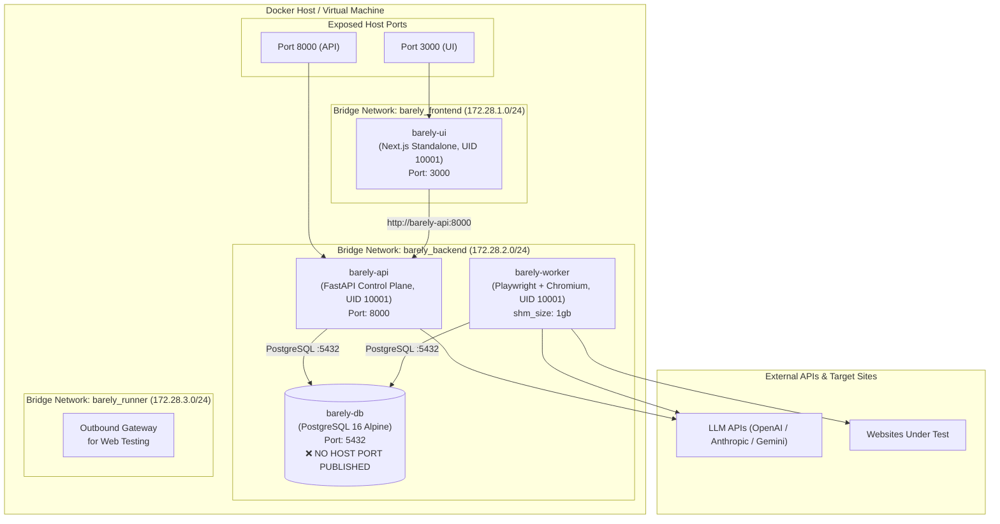

# 🐳 Barely - Production Docker Compose Deployment Guide

This guide covers running **Barely** in production or local environments using hardened Docker Compose.

---

## Architecture Overview



### Security & Hardening Highlights
1. **Network Segmentation**:
   - `barely_frontend`: Connects UI and API to handle ingress web traffic.
   - `barely_backend`: Internal network connecting API, Worker, and Database. **`barely-ui` is not on this network**, preventing frontend containers from accessing the database directly.
   - `barely_runner`: Outbound bridge enabling Worker to reach web applications under test without exposing any inbound ports.
2. **Database Port Protection**:
   - `barely-db` uses `expose: ["5432"]` rather than `ports: ["5432:5432"]`. The database is **never published to the host network**, eliminating port scanning vulnerabilities.
3. **Chromium Shared Memory**:
   - `shm_size: '1gb'` is allocated to `barely-worker`, preventing browser tab crashes during high-concurrency visual DOM analysis.
4. **Non-Root Execution**:
   - Both API and UI run as unprivileged UID `10001:10001`.

---

## Quickstart (Production Mode)

### 1. Prerequisites
- Docker Engine 24.0+
- Docker Compose v2.20+

### 2. Configure Environment Variables
Create a `.env` file in the project root:
```bash
# Database Credentials
POSTGRES_USER=barely
POSTGRES_PASSWORD=your_super_secret_password_here
POSTGRES_DB=barelydb

# AI Model Provider API Keys
ANTHROPIC_API_KEY=sk-ant-api03-...
OPENAI_API_KEY=sk-proj-...
GEMINI_API_KEY=AIzaSy...

# Optional Integrations
JIRA_BASE_URL=https://yourcompany.atlassian.net
JIRA_EMAIL=dev@yourcompany.com
JIRA_API_TOKEN=your_jira_api_token
SLACK_WEBHOOK_URL=https://hooks.slack.com/services/...
```

### 3. Build & Launch
```bash
# Build optimized containers and launch in detached mode
docker compose up -d --build
```

### 4. Verify Service Health
```bash
docker compose ps
```
All containers should transition to `healthy`:
```
NAME                    IMAGE                  STATUS                   PORTS
barely-barely-api-1     barely-barely-api      Up (healthy)             0.0.0.0:8000->8000/tcp
barely-barely-db-1      postgres:16-alpine     Up (healthy)             5432/tcp
barely-barely-ui-1      barely-barely-ui       Up (healthy)             0.0.0.0:3000->3000/tcp
barely-barely-worker-1  barely-barely-worker   Up                       
```

Access the UI at [http://localhost:3000](http://localhost:3000) and the API docs at [http://localhost:8000/docs](http://localhost:8000/docs).

---

## Local Development Mode (Hot Reloading)

For active feature development, use `docker-compose.dev.yml` to enable live source code bind mounts, auto-reloading API server, and exposed database port:

```bash
docker compose -f docker-compose.yml -f docker-compose.dev.yml up
```

- **Frontend Hot-Reloading**: Next.js recompiles immediately upon file edits.
- **Backend Hot-Reloading**: Uvicorn restarts on changes to Python code in `packages/`.
- **Direct DB Inspection**: Connect your local database GUI (TablePlus, DBeaver) to `localhost:5432`.

---

## Database Management

### Backup Database
```bash
docker compose exec barely-db pg_dump -U barely barelydb > backup_$(date +%Y%m%d).sql
```

### Restore Database
```bash
docker compose exec -T barely-db psql -U barely barelydb < backup_20260918.sql
```

---

## Useful Operational Commands

```bash
# View aggregated real-time logs
docker compose logs -f

# View logs for a specific service
docker compose logs -f barely-worker

# Restart the worker service
docker compose restart barely-worker

# Stop all services and preserve data
docker compose down

# Stop all services and wipe persistent volume data (Clean Reset)
docker compose down -v
```
