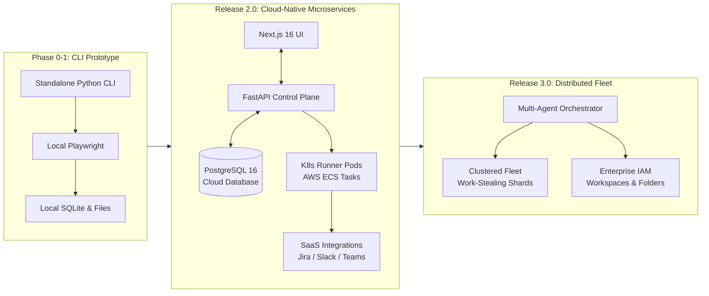
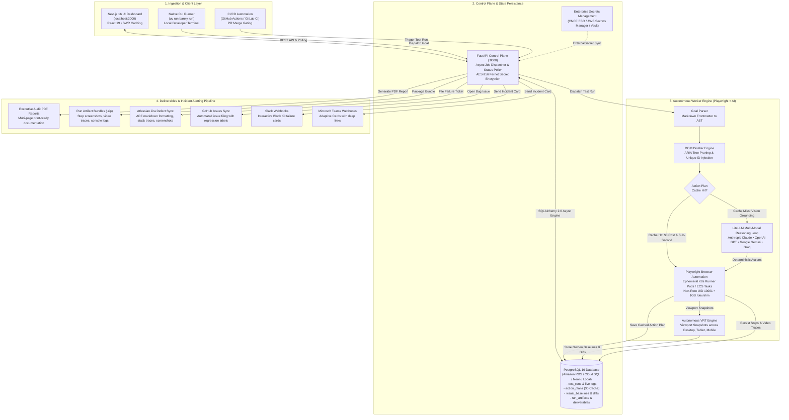
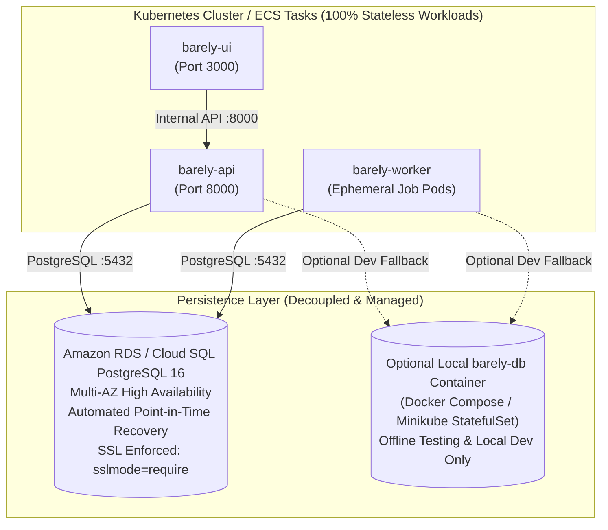
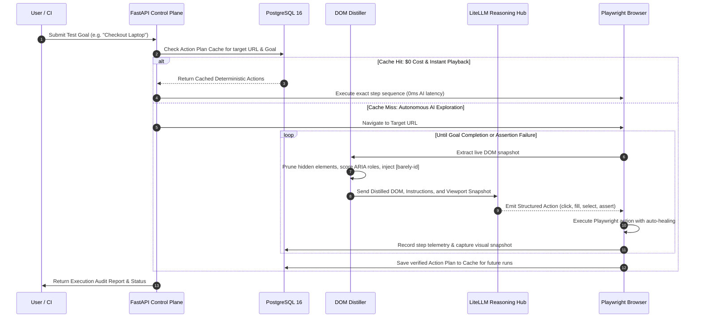

# 🏛️ Barely — System Architecture & Cloud Engineering Guide

Barely is an enterprise-grade autonomous visual AI end-to-end testing platform. It translates natural language test goals and intent into deterministic Playwright browser actions, maintains visual baselines, automatically heals fragile locators, and syncs regression defects directly into issue tracking and incident management tools.

This document details the architectural evolution, microservices topology, cloud execution primitives, zero-trust security model, and data flow of Barely **Release 2.0 "Boss Penguin"** and beyond.

---

## 1. Architectural Evolution



- **Phase 0–1 (Modular Monolith CLI)**: Single-process runner using SQLite and local HTML reporting for local developers.
- **Release 2.0 "Boss Penguin" (Cloud-Native Microservices)**: Decoupled FastAPI control plane, Next.js 16 dashboard, external PostgreSQL 16 persistence, ephemeral Kubernetes runner pods (`UID 10001`), AWS ECS Terraform modules, automated Jira/GitHub defect filing, and Slack/Teams incident alerts.
- **Release 3.0 (Distributed Multi-Agent Fleet)**: Clustered runner orchestration with intra-suite dynamic sharding, work-stealing, collaborative multi-agent testing, enterprise RBAC/IAM, and batched notification rollups.

---

## 2. End-to-End System Architecture & Control Flow

The production execution lifecycle of Barely across client ingestion, control plane, autonomous worker reasoning, and deliverable pipelines:



---

## 3. Database Architecture: Stateless Workloads vs. Managed Cloud Storage

A foundational principle of Barely's production architecture is **100% Stateless Application Workloads**.



### When is PostgreSQL a Container/Pod?
- **Local Development (`docker compose up -d`)**:
  Spins up `barely-db` using `postgres:16-alpine` on an isolated Docker bridge network (`barely_backend`). No host ports are exposed (`expose: ["5432"]`), allowing instant local evaluation without AWS accounts.
- **Offline / Air-Gapped Kubernetes (Minikube / Kind / Datacenters)**:
  For local testing without cloud access, setting `database.inCluster.enabled=true` in Helm provisions `barely-postgresql-0` as a local StatefulSet with a 10Gi PersistentVolumeClaim.

### When is PostgreSQL Cloud-Managed? (Production EKS / GKE / AKS & ECS)
In cloud production, running stateful relational databases inside Kubernetes pods is an operational anti-pattern:
- **Pod Eviction & Node Preemption**: When Kubernetes nodes restart or run out of memory, stateful database pods are killed and rescheduled. Persistent Volume Claims (PVCs) can experience mounting locks, taking minutes to recover.
- **Managed Reliability**: Managed cloud databases (Amazon RDS PostgreSQL 16, Google Cloud SQL, Neon, Supabase) deliver automated Multi-AZ failover (< 30 seconds), point-in-time recovery, automated backups, and zero downtime maintenance.
- **Infinite Stateless Scaling**: Because the database is external, every pod inside the Kubernetes cluster (`barely-ui`, `barely-api`, `barely-worker`) is **100% stateless**. Workloads can autoscale from 2 to 50+ parallel runner pods via HPA without any risk of database volume corruption.

---

## 4. Multi-Modal AI Reasoning & Action Caching Engine

Barely eliminates the brittleness of traditional CSS/XPath locators by combining **DOM distillation** with **multi-modal vision reasoning** and **deterministic plan caching**:



### Action Plan Caching ($0 Cost Regressions)
- On the initial run of a test goal, the AI agent explores the DOM, validates locators, and executes steps.
- Upon passing, Barely compiles the exact deterministic sequence into an **Action Plan** stored in PostgreSQL.
- Subsequent regression runs bypass LLM API calls entirely: tests execute in milliseconds via pure Playwright at **$0 cost**.
- If a web UI changes and a cached action fails, Barely automatically triggers **Autonomous Fallback Healing**, re-engaging the AI loop to discover updated selectors and re-cache the new path.

---

## 5. Enterprise Cloud Deployments & Security Hardening

Barely is engineered to comply with enterprise cloud security standards across container runtimes and orchestration platforms:

### 1. Restricted Pod Security Standards (UID 10001)
Every container (API, Worker, UI) runs as an unprivileged non-root user:
```yaml
securityContext:
  runAsNonRoot: true
  runAsUser: 10001
  runAsGroup: 10001
  allowPrivilegeEscalation: false
  capabilities:
    drop: ["ALL"]
  seccompProfile:
    type: RuntimeDefault
```

### 2. Chromium Shared Memory Protection (`/dev/shm 1Gi`)
Browser engines execute intensive multi-tab layout rendering. Without dedicated shared memory, Docker containers frequently crash with `SIGSEGV` or `Target closed`. Barely provisions 1GB dedicated `/dev/shm` across Docker Compose, Kubernetes Helm, and AWS ECS task definitions.

### 3. Zero-Leak Secrets Management
- **AES-256 Fernet Encryption**: Sensitive tokens (API keys, Jira tokens, Slack webhooks) are encrypted dynamically in PostgreSQL.
- **Zero-Leak Masking**: Keys are sanitized and masked in all API responses and UI components (`sk-ant-***`).
- **CNCF External Secrets Operator (ESO)**: Native support for synchronizing secrets directly from AWS Secrets Manager or HashiCorp Vault into Kubernetes pods without plain-text storage in Helm values.

---

## 6. Automated Issue Tracking & Notification Architecture

When a test run finishes or encounters visual/functional regressions, Barely automatically dispatches incident telemetry:

| Integration | Protocol | Payload Type | Key Capabilities |
| :--- | :--- | :--- | :--- |
| **Atlassian Jira** | REST API v3 | Atlassian Document Format (ADF) | Auto-creates bug tickets with reproduction steps, error logs, and failure screenshot attachments. |
| **GitHub Issues** | REST API v3 | GitHub Flavored Markdown | Automatically files defects with configurable labels (`bug`, `regression`), system specs, and run deep links. |
| **Slack** | Incoming Webhooks | Block Kit JSON | Contextual alert cards featuring test status badges, target URL, failure details, and direct links to Jira/GitHub. |
| **Microsoft Teams**| Incoming Webhooks | Adaptive Cards JSON | Rich interactive cards with status indicator dots, metadata tables, and action buttons. |

> **Standalone Guarantee**: When integrations are unconfigured or toggled off, Barely operates with **0 external HTTP requests** and **0ms latency penalty**.

---

## 7. Release 3.0 Architectural Evolution (Roadmap)

Barely's next major release transitions the platform from single-suite execution to **distributed multi-agent fleet orchestration**:

1. **Multi-Agent Fleet Orchestrator**:
   - Dynamic intra-suite sharding: An orchestrator leader agent dynamically partitions large suites (100+ tests) across clustered runner pods with intelligent work-stealing.
   - Multi-agent collaborative workflows: Simultaneous distinct agents executing inside the same session (e.g. Agent 1 acting as Buyer and Agent 2 acting as Seller in real-time).
2. **AI Execution Guardrails & Safety Policies**:
   - Autonomous boundary policies, target domain whitelisting, strict request rate limiting, and prompt injection filters protecting live web automation.
3. **Enterprise IAM, Workspaces & Test Folders**:
   - Multi-tenant role-based access control (RBAC), SSO/SAML auth, isolated team workspaces, and nested folder-based test suite organization.
4. **Smart Batched Notification Engine**:
   - Context-aware alert aggregation: individual test runs notify immediately, while test folder and suite runs automatically batch results into unified rollup summaries with multi-test status cards.
