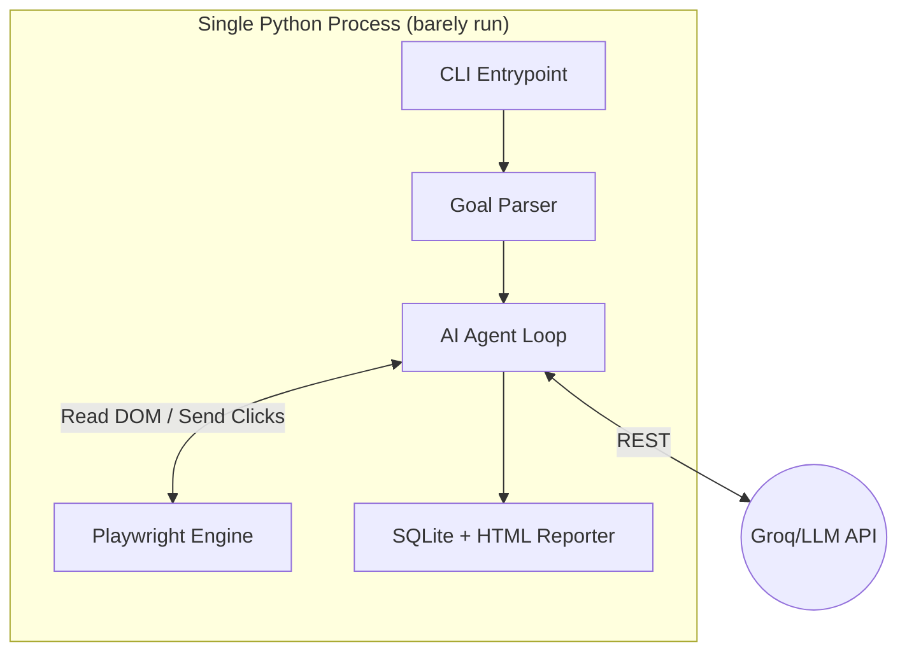
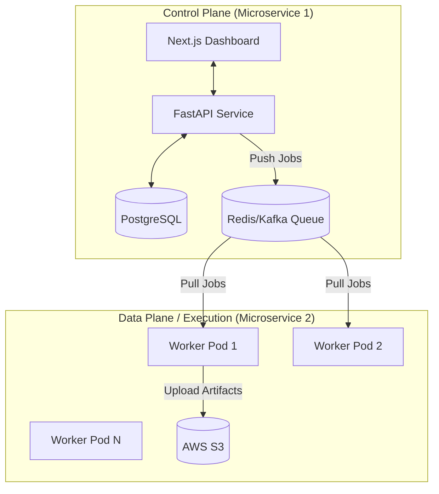
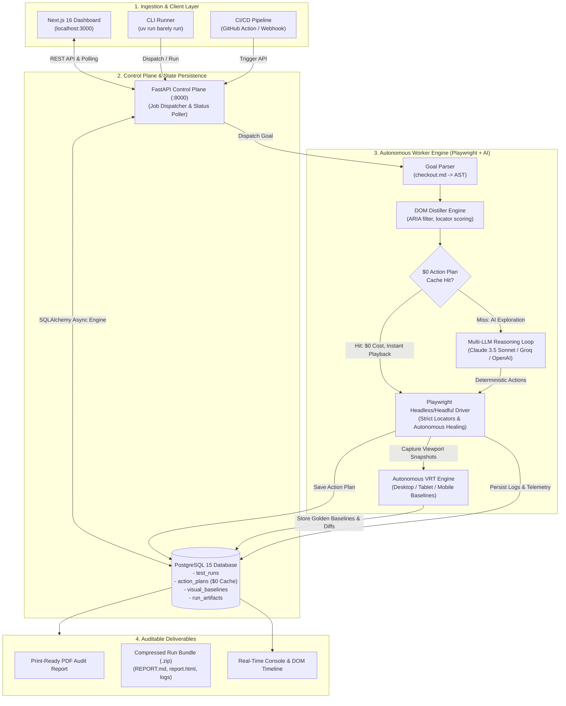

# Barely — Architecture Evolution

## Phase 0-2: The Modular Monolith (CLI-First)
Designed for velocity, local development, and easy CI/CD integration.

## Phase 3-5: Enterprise Microservices
Designed for massive parallel execution and dashboard management.

## Release 1.0 Production System & Control Flow

The complete end-to-end execution flow of Barely across the ingestion, control plane, autonomous worker, and deliverables pipelines:

