# Barely Audit Reports & Human-Readable Telemetry

Autonomous AI QA testing is only as trustworthy as the audit trail it leaves behind. When an AI agent executes tests across web applications, QA managers, developers, and non-technical stakeholders need clear, human-understandable evidence of:
1. **What user instruction was being tested**
2. **Why the AI chose a specific action**
3. **What exact action was executed on the UI**
4. **Visual proof of the result**

This document explains Barely's **Human-Readable Element Abstraction** and the **4-Tier Step Audit Architecture** used across all generated PDF, HTML, Markdown, and JSON deliverables.

---

## 🧩 1. Human-Readable UI Element Abstraction

### The Problem with Low-Level Technical Locators
Under the hood, Barely's DOM Distiller injects synthetic anchor tags (`[barely-id="9"]`) to allow the LLM to target elements with 100% precision. However, exposing internal IDs like `[9]` or `[barely-id="9"]` in reports creates technical friction for product managers and QA leads.

### How Barely Abstracts Elements
Barely automatically translates interactive DOM nodes into natural, human-readable labels:

| Internal Element | Tag & Accessibility Attributes | Human-Readable Audit Output |
| :--- | :--- | :--- |

```mermaid
flowchart LR
    A["Interactive DOM Node\n[barely-id='9'] <input name='q'>"] --> B["_get_element_label() Engine"]
    B --> C["Human-Centric Audit String\n'Search' input field"]
    C --> D["Executive PDF & HTML Reports"]
```

| `[barely-id="9"]` | `<input name="q" placeholder="Search">` | `Typed 'Gitansh Kapoor' into "Search" input field and pressed Enter` |
| `[barely-id="10"]` | `<button>Google Search</button>` | `Clicked "Google Search" button` |
| `[barely-id="3"]` | `<a href="/pricing">View Plans</a>` | `Clicked "View Plans" link` |
| `[barely-id="7"]` | `<select name="country">` | `Selected option in "country" dropdown` |



---

## 📊 2. The 4-Tier Step Audit Architecture

Every execution step recorded by Barely is structured into 4 transparent tiers:

```
┌────────────────────────────────────────────────────────────────────────┐
│ EXECUTION STEP 1                                                       │
├────────────────────────────────────────────────────────────────────────┤
│ 🎯 1. Target Goal Instruction                                          │
│    Mapped directly to the user's test scenario line:                    │
│    "Login to the Webpage using following creds"                        │
│                                                                        │
│ 💭 2. AI Agent Reasoning                                               │
│    Transparent chain-of-thought explaining the strategy:              │
│    "Locating login fields in the DOM. Entering standard demo           │
│     credentials into the username input."                              │
│                                                                        │
│ ⚡ 3. Action Executed                                                   │
│    Concrete operation performed on the UI:                             │
│    Typed 'standard_user' into "Username" input field                   │
│                                                                        │
│ 📷 4. Visual Verification                                              │
│    High-resolution viewport screenshot captured right after execution │
│    [ Photographic Proof of Current DOM State ]                         │
└────────────────────────────────────────────────────────────────────────┘
```

---

## 📦 3. Deliverable Formats

Barely produces four synchronized audit formats with 100% data parity:

### 1. Executive Multi-Page PDF (`barely_pdf`)
- Designed for compliance, management sign-off, and customer deliverables.
- Rendered via ReportLab with colored status headers (`PASSED` in emerald, `FAILED` in rose), structured step cards, and embedded viewport screenshots formatted for Letter/A4 printing.

### 2. Standalone HTML Audit Report (`report.html`)
- Interactive, responsive web report exportable directly from the Barely Control Plane API (`/api/runs/{id}/report`).
- Includes one-click Print-to-PDF (`?print=true`), embedded Base64 screenshots (zero external assets), dark-mode styling, and detailed diagnostic failure boxes with root-cause analysis.

### 3. GitHub-Flavored Markdown (`REPORT.md`)
- Ready to be posted directly into GitHub PR comments, GitLab issues, or team wikis.
- Formatted with Markdown checklists, collapsible failure logs, and step audit trails.

### 4. Structured Telemetry JSON (`run_data.json`)
- Clean JSON payload containing all steps with `target_instruction`, `action_executed`, `thought`, device profiles, run tags, and failure diagnostics.
- Ideal for programmatic ingestion into Jira, Datadog, Slack webhooks, or custom CI/CD analytics pipelines.

---

## 🔌 API & Export Endpoints

| Endpoint | Method | Output | Description |
| :--- | :--- | :--- | :--- |
| `/api/runs/{id}/report` | `GET` | HTML | Interactive web report with print-to-PDF support |
| `/api/runs/{id}/download` | `GET` | ZIP | Complete bundle (`report.html`, `REPORT.md`, `run_data.json`) |
