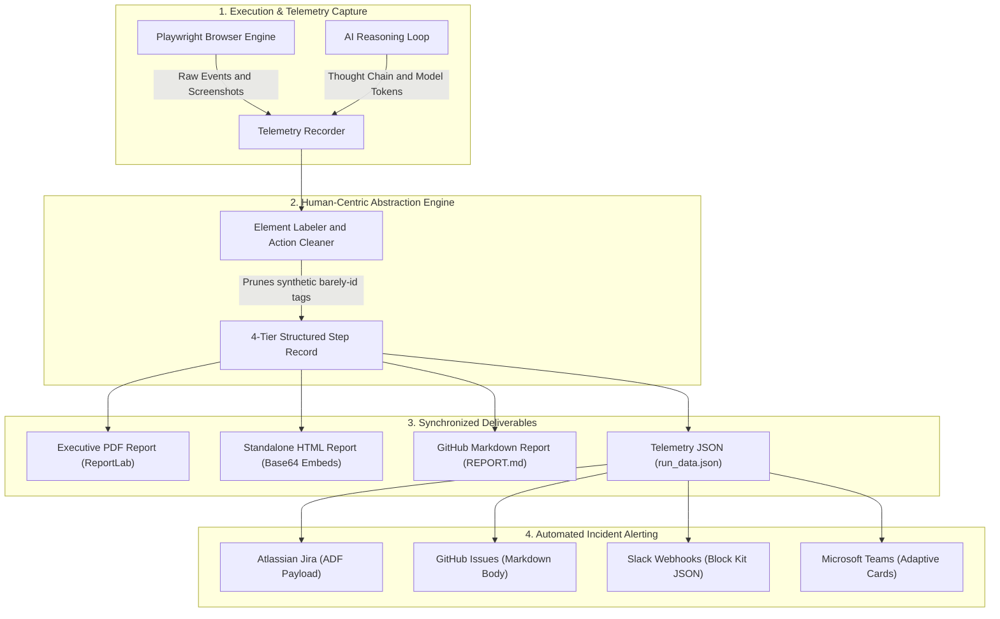

# 📋 Barely — Audit Reports & Human-Readable Telemetry Guide

Autonomous AI QA testing is only as trustworthy as the audit trail it leaves behind. When an AI agent executes tests across complex web applications, QA managers, engineering leads, and non-technical stakeholders require deterministic, human-understandable evidence of:
1. **What user instruction was being tested**
2. **Why the AI chose a specific action** (chain-of-thought strategy)
3. **What exact action was executed on the UI** (human-readable label, not obscure CSS locators)
4. **Photographic visual proof of the DOM state before and after execution**

This document details Barely's **4-Tier Step Audit Architecture**, **Human-Readable Element Abstraction Engine**, **Application Context Tracking**, **$0 Action Cache Telemetry**, and the synchronized **Deliverables & Incident Alerting Pipeline**.

---

## 1. End-to-End Audit & Telemetry Pipeline

The telemetry lifecycle captures raw browser events and model reasoning, converts them into human-centric audit trails, and formats them across four deliverable mediums and enterprise incident channels:



---

## 2. The 4-Tier Step Audit Architecture

Every execution step recorded by Barely is structured into 4 transparent tiers:

```
┌────────────────────────────────────────────────────────────────────────┐
│ EXECUTION STEP 1                                                       │
├────────────────────────────────────────────────────────────────────────┤
│ 🎯 1. Target Goal Instruction                                          │
│    Mapped directly to the user's declarative test scenario line:       │
│    "Login to the Webpage using following creds"                        │
│                                                                        │
│ 💭 2. AI Agent Reasoning                                               │
│    Transparent chain-of-thought explaining the operational strategy:   │
│    "Locating login fields in the DOM. Entering standard demo           │
│     credentials into the username input."                              │
│                                                                        │
│ ⚡ 3. Action Executed                                                   │
│    Concrete, human-readable operation performed on the UI:             │
│    Typed 'standard_user' into "Username" input field                   │
│                                                                        │
│ 📷 4. Visual Verification                                              │
│    High-resolution viewport screenshot captured right after execution  │
│    [ Photographic Proof of Current DOM State ]                         │
└────────────────────────────────────────────────────────────────────────┘
```

### Tier Breakdown
- **🎯 1. Target Goal Instruction**: Correlates the step to the high-level intent declared in `.barely/goals/*.md` (e.g. `1. Add first product to cart`).
- **💭 2. AI Agent Reasoning**: Exposes the real-time reasoning emitted by the multi-modal LLM (Claude, GPT, Gemini) as it analyzes distilled ARIA trees and visual screenshots.
- **⚡ 3. Action Executed**: The deterministic Playwright operation executed (`click`, `fill`, `select`, `assert`), scrubbed of internal IDs and expressed in plain English.
- **📷 4. Visual Verification**: High-resolution screenshot captured post-action to visually confirm DOM state transitions and locator accuracy.

---

## 3. Human-Readable Element Abstraction Engine

### The Problem with Synthetic Locators
Under the hood, Barely's DOM Distiller injects synthetic anchor tags (`[barely-id="9"]`) to allow the LLM to target elements with 100% precision. However, displaying internal IDs like `[9]` or `[barely-id="9"]` in reports creates technical friction for product managers and QA leads.

### Abstraction Mechanics
Barely's `clean_action_description()` engine combines the AI agent's reasoning chain with DOM accessibility labels, ARIA roles, and element metadata to produce clear, executive-friendly summaries:

| Raw Technical Event | Synthetic DOM Locator | Human-Readable Audit Output |
| :--- | :--- | :--- |

```mermaid
flowchart LR
    A["Raw Action & DOM Tag\n[barely-id='9'] <input name='q'>"] --> B["_get_element_label() Engine"]
    B --> C["Human-Centric Audit String\nTyped into 'Search' field"]
    C --> D["Executive PDF & HTML Reports"]
```

| `page.fill('[barely-id="9"]', 'standard_user')` | `<input name="user-name" placeholder="Username">` | `Typed 'standard_user' into "Username" input field` |
| `page.click('[barely-id="12"]')` | `<button id="login-button">Login</button>` | `Clicked "Login" button` |
| `page.click('[barely-id="3"]')` | `<a href="/cart">Cart <span class="badge">1</span></a>` | `Clicked "Cart" link` |
| `page.select_option('[barely-id="7"]', 'lohi')` | `<select class="product_sort_container">` | `Selected option in "Sort" dropdown` |



---

## 4. Application Context in Audit Reports (`context:`)

When a goal includes domain constraints, credentials, or persona guidelines, Barely captures this metadata in the run audit trail:

```yaml
---
name: Checkout Flow
tags: [smoke, e2e, checkout]
timeout: 120
strict_mode: false
context: "You are testing an e-commerce store ABC. Act as a shopper browsing the catalog, managing cart, and purchasing."
---
```

### How Application Context is Displayed
1. **Report Header Banner**: Displayed prominently below the test title as the official test scope and persona specification.
2. **AI Reasoning Grounding**: Surfaced in the step audit reasoning to show how the AI respected domain rules (e.g. *"Dismissing promotional popup in accordance with test context constraints"*).
3. **Structured Telemetry**: Exported under the `application_context` key in `run_data.json` for CI/CD audit compliance.

---

## 5. $0 Action Plan Caching & Healing Telemetry

When test goals execute repeatedly across stable application builds, Barely leverages its **Action Plan Cache** to deliver sub-second execution at **$0 AI cost**:

### Telemetry States
- **⚡ Cache Hit ($0 Cost Replay)**:
  - Header badge: `⚡ Action Plan Cache Hit • $0 AI Cost • 0ms LLM Latency`
  - Telemetry logs: Records `cached: true` for all replayed steps.
  - Execution speed: Runs in pure Playwright (sub-second per step).
- **🔄 Fallback Healing Event**:
  - Trigger: A cached selector fails due to a DOM change or redesign.
  - Telemetry card: Highlights the self-healing event in amber, showing the legacy locator vs the newly discovered locator.
  - Action taken: Automatically verifies the step via vision grounding and re-caches the updated path for future runs.

---

## 6. Synchronized Deliverable Formats

Barely produces four synchronized audit formats with 100% data parity:

### 1. Executive Multi-Page PDF (`barely_pdf`)
- **Use Case**: Management sign-offs, compliance archives, customer-facing verification.
- **Engine**: Rendered via Python `reportlab` with Letter/A4 pagination.
- **Features**: Emerald/rose status banners, structured step cards, failure diagnostic callouts, and embedded viewport screenshots.

### 2. Standalone HTML Audit Report (`report.html`)
- **Use Case**: Browser-based interactive investigation, shareable run artifacts.
- **Engine**: Zero-dependency standalone HTML generated by the FastAPI control plane (`/api/runs/{id}/report`).
- **Features**:
  - Embedded Base64 screenshots (100% self-contained file, no external assets).
  - Print-to-PDF button (`window.print()`).
  - Dark-mode developer styling with responsive step cards.
  - Diagnostic failure boxes with stack traces and root-cause analysis.

### 3. GitHub-Flavored Markdown (`REPORT.md`)
- **Use Case**: Pull request comments, GitLab merge request checks, team wikis.
- **Features**: Markdown checklists, collapsible step histories, and direct run deep links.

### 4. Structured Telemetry JSON (`run_data.json`)
- **Use Case**: Programmatic ingestion into data lakes, Datadog, Grafana, or custom analytics pipelines.
- **Payload Schema**:
  ```json
  {
    "run_id": "run-9f8a2b3c",
    "goal_name": "Checkout Flow",
    "status": "completed",
    "success": true,
    "duration_seconds": 14.2,
    "model": "anthropic/claude-3-7-sonnet",
    "cached_replay": false,
    "application_context": "You are testing an e-commerce store ABC.",
    "steps": [
      {
        "step_index": 1,
        "target_instruction": "Navigate to https://shop.example.com",
        "thought": "Navigating to starting store URL.",
        "action_executed": "Navigated to https://shop.example.com",
        "timestamp": "2026-09-19T10:15:22Z"
      }
    ]
  }
  ```

---

## 7. Incident & Defect Sync Payloads

When a test run fails or detects a functional regression, Barely automatically formats and delivers defect payloads:

### 1. Atlassian Jira (ADF Format)
- **Format**: Atlassian Document Format (ADF) JSON via REST API v3.
- **Content**:
  - Executive summary and root-cause diagnostic box.
  - Step-by-step reproduction table with target instructions, thoughts, and actions.
  - Attached failure screenshots and system metadata.

### 2. GitHub Issues
- **Format**: GitHub Flavored Markdown via REST API.
- **Content**: Automatically filed with labels (`bug`, `regression`), environment details, reproduction steps, and deep links to the Barely web report.

### 3. Slack Webhooks (Block Kit)
- **Format**: Block Kit JSON.
- **Content**: Status color bar (rose for failure, emerald for pass), test name, target URL, failure reason snippet, and interactive buttons linking to the HTML report and Jira ticket.

### 4. Microsoft Teams Webhooks (Adaptive Cards)
- **Format**: Adaptive Cards v1.4 JSON.
- **Content**: Status badge, structured fact sets (Environment, Duration, Model, Trigger), failure error text, and action buttons.

---

## 8. API & Export Endpoints

| Endpoint | Method | Output | Description |
| :--- | :--- | :--- | :--- |
| `/api/runs/{id}/report` | `GET` | HTML | Interactive standalone web report with print-to-PDF support |
| `/api/runs/{id}/download` | `GET` | ZIP | Complete deliverable bundle (`report.html`, `REPORT.md`, `run_data.json`) |
| `/api/runs/{id}/steps` | `GET` | JSON | Granular step-by-step telemetry array with screenshot Base64 |
| `/api/runs/{id}/status` | `GET` | JSON | Real-time run execution status and failure diagnostics |
